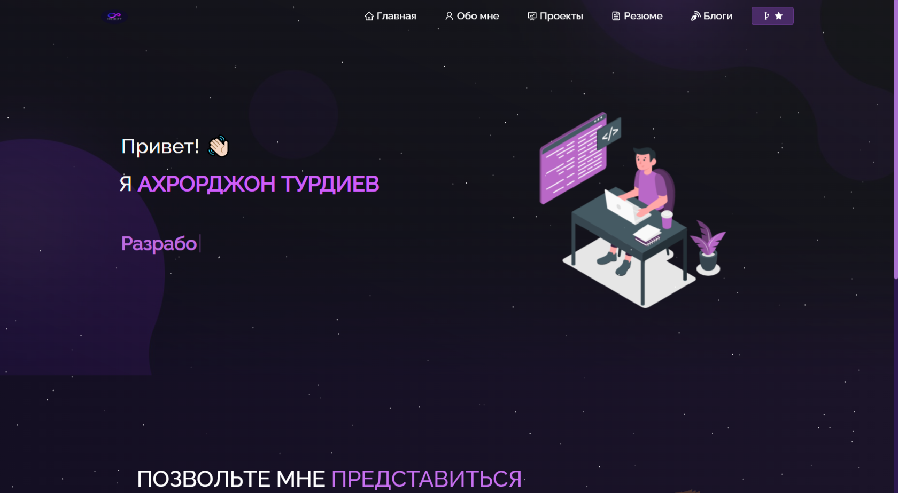

<h2 align="center">
  Portfolio Website - v1.0 
  <a href="https://port-wine-kappa.vercel.app" target="_blank">neo</a>
</h2>

  

 

Этот проект был построен с использованием этих технологий.

- React.js
- Node.js
- Express.js
- CSS3
- VsCode
- Vercel

## Features

**📖 Многостраничный макет**

**🎨 Стилизовано с помощью React-Bootstrap и Css, цвета легко настраивать**

**📱 Полностью адаптивный**

## Начиная

Клонируйте этот репозиторий. Вам понадобятся `node.js` и `git`, установленные глобально на вашем компьютере.

## 🛠 Инструкция по установке и настройке

1. Установка: `npm install`

2. В каталоге проекта вы можете запустить: `npm start`

Запускает приложение в режиме разработки.\
Откройте [http://localhost:3000](http://localhost:3000), чтобы просмотреть его в браузере.
Страница перезагрузится, если вы внесете изменения.

## Инструкция по использованию

Откройте папку проекта и перейдите к `/src/comComponents/`.  
Вы найдете все используемые компоненты и сможете соответствующим образом отредактировать свою информацию.

### Покажите свою поддержку

Поставьте ⭐, если вам нравится этот сайт!
